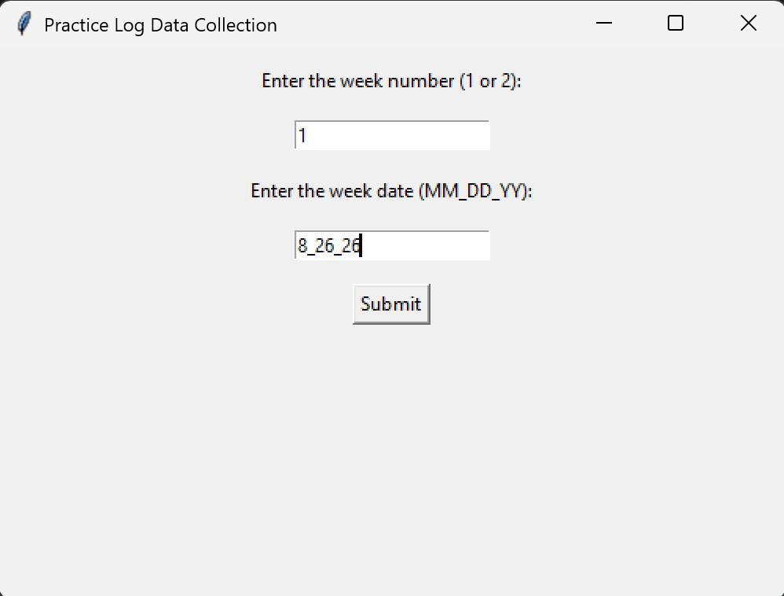

# practice-room-data

This project extracts the practice room data from the practice room reservation google sheet from the UW-Madison percussion studio. The data is collected, cleaned, analyzed, and displayed using Python.

## Background

The google spreadsheet is grouped by room, and 15 minute intervals from 7am to 11pm are available to be signed out for each room, and the sheet is reset every week (data is not saved).

## How it works

### 1. Data collection (practice-log-data-collection.py)

Manually collecting the reservation data that would otherwise be lost because the google sheet is cleared weekly

- _gspread_ is used to access the google spreadsheet
- Each room is iterated through, formatted with _pandas_, and certain gaps are filled in
- _tkinter_ is used as a local interface to guide the data collection process
- Two inputs are required: week number and date, which tells the program what week to collect the data from and what folder to store it in
- Once the submit button is pressed with valid inputs, that week's data is saved to a folder with the rest of the data

### 2. Analysis (Practice Log.ipynb)

- All of the room data is compiled into one large _pandas_ dataframe
- All entries are iterated through and normalized/cleaned into another dataframe to allow for easier manipulation
- Using various aggregation methods, several significant statistics are determined, such as Time Practiced, Favorite Practice Room, and Most Practicing in a Day
- Multiple graphs are created such as Grade Level vs. Average Number of Entries, Room vs. Number of Entries, and Day vs. Number of Entries
- Some machine learning is experimented with to make predictions of the occupancy of rooms
  - Several features engineered such as **previous_day** and **previous_week** using _Timedelta_.
  - Models built and fit using _sklearn LogisticRegression_ and _RandomForestClassifier_
  - Metrics are produced and reported regarding the performance of the models

### 3. Visualization/Reports (app.py)

- _Streamlit_ powered app uploaded to the Streamlit Community Cloud so anyone can access it
- Three pages:
  1. **Live Schedule** provides the schedule for the day by room and timeframe, making it easier to know what rooms are occupied that day. There is also detection for what rooms are currently occupied
  2. **Occupancy Predictions** provides predictions for occupancy of different rooms and different times using a ML model
  3. **Statistics** provides the user with various statistics based on the selected date timeframe, such as graphs and room usage

## Disclaimer

It's important to note that this data is not necessarily representative of the practice habits of the percussion studio because studio members are human beings and are sometimes late, early, or don't even sign out the practice rooms. In reality, this data is more representative of the reserving habits of the studio members.
